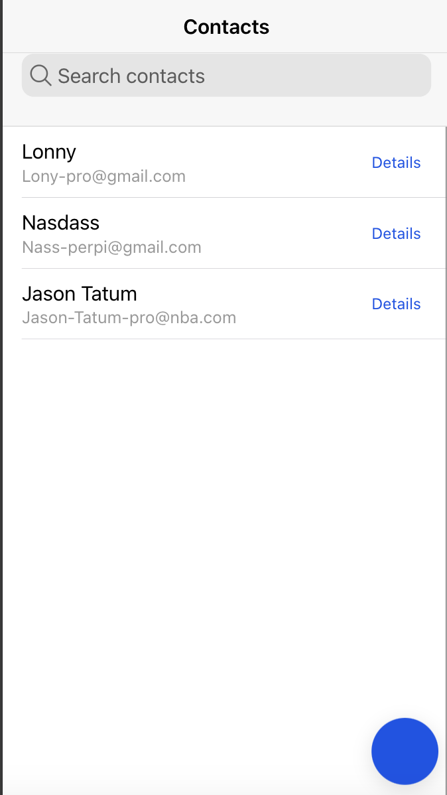
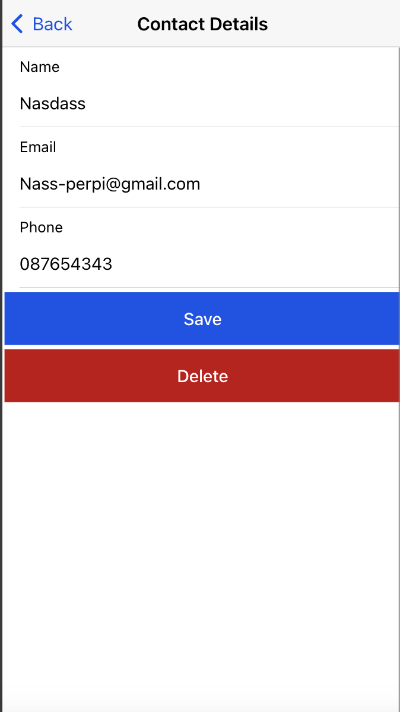

# Gestion de Contacts avec Ionic et Vue.js

Ce projet est une application de gestion de contacts développée avec Ionic et Vue.js, utilisant Vite pour le bundling. L'application permet d'ajouter, de modifier, de supprimer et de rechercher des contacts.

## Fonctionnalités

- **Liste des contacts** : Affiche tous les contacts enregistrés.
- **Ajouter un contact** : Permet d'ajouter un nouveau contact.
- **Modifier un contact** : Permet de modifier les informations d'un contact existant.
- **Supprimer un contact** : Permet de supprimer un contact.
- **Recherche de contacts** : Permet de rechercher des contacts par nom ou email.

## Prérequis

- Node.js (version 14 ou supérieure)
- npm (version 6 ou supérieure) ou Yarn

## Installation

1. Clonez le dépôt :
   ```bash
   git clone <votre-repo-git>
   cd <votre-repo>
   ```

2. Installez les dépendances :
   ```bash
   npm install
   ```

## Lancer l'application

Pour démarrer l'application en mode développement, utilisez la commande suivante :

```bash
ionic serve
```

## Captures d'écran

### Interface d'accueil



### Interface d'édition



## Structure du projet

```
.
├── src
│   ├── assets
│   ├── components
│   ├── router
│   │   └── index.js
│   ├── views
│   │   ├── Home.vue
│   │   ├── CreateContact.vue
│   │   ├── EditContact.vue
│   │   └── ContactDetail.vue
│   ├── App.vue
│   └── main.js
├── public
├── README.md
├── package.json
└── vite.config.js
```

## Contribuer

Les contributions sont les bienvenues ! Veuillez soumettre une pull request ou ouvrir une issue pour discuter des modifications que vous souhaitez apporter.

## License

Ce projet est sous licence MIT. Voir le fichier [LICENSE](./LICENSE) pour plus de détails.
